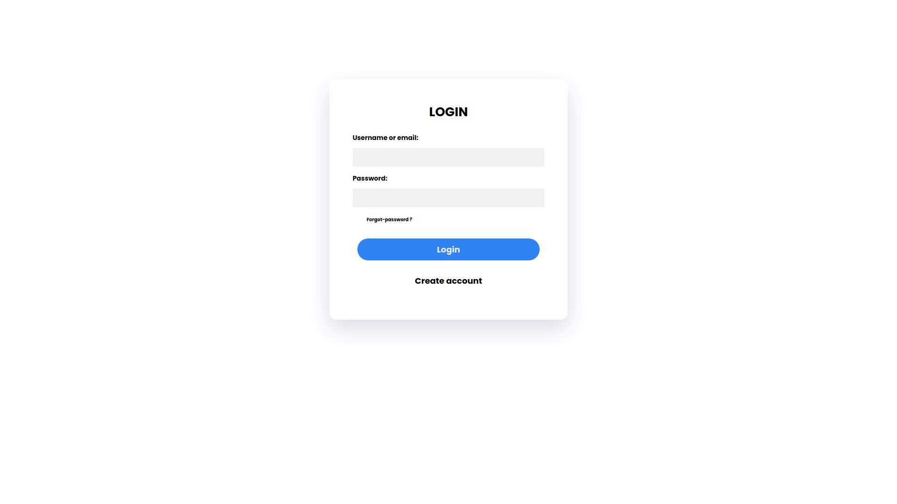
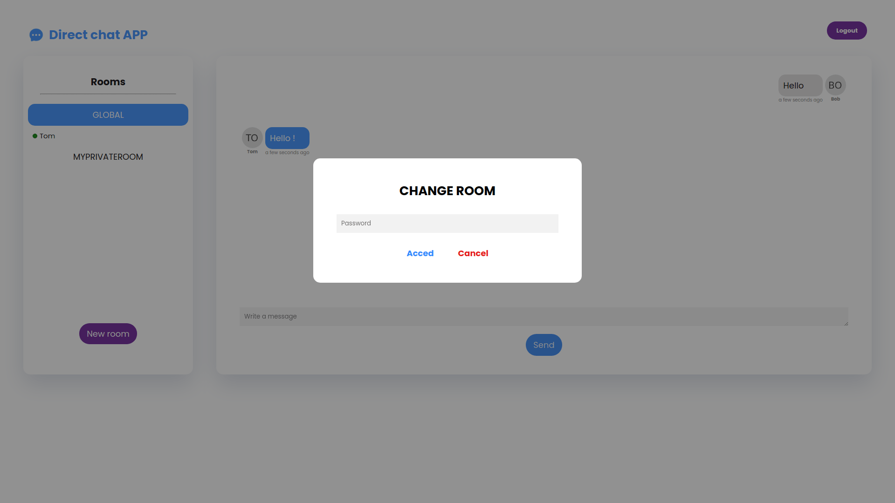

# Chat application - front vuejs

An example of a Chat application in JS with room management registration and real login saved in MongoDB written in typescript

The back part is here: https://github.com/juliendu11/Chat-Application-Back-Express (it's Express and Socket.io in typescript)







## TODO

- [X] Enforce typescript because is not full typescript
- [] Add unit tests
- [] Add e2e tests
- [X] Refresh jwt token before expiration
- [] Add private message
- [] Show all member registered not just online
- [] Sending image
- [X] Add env for API URL
- [] Add support push notification (PWA)
- [X] Email format verification for Auth page
- [X] Add retype password for register page
- [X] Add users list connected per room
- [X] Add logout
- [X] Load more messages when scroll in TOP
- [X] Private room

## How to use ?


### Download source code


````bash
git clone https://github.com/juliendu11/Chat-Application-Front-Vue3.git
````

### Install dependencies

````
enter in folder and use npm i
````

### Create an .env file in the root

````javascript
VUE_APP_API_URL= 'http://localhost:3000/api' // => Backend API url
VUE_APP_JWT_TOKEN_NAME= 'jwt' // => JWT token name save in localStorage
VUE_APP_JWT_EXPIRE_IN_MINUTES=10 // => Auto refresh jwt token interval to avoid being disconnected. Before JWT expiration time set in backend !
VUE_APP_SOCKET_IO_URL='http://localhost:3000/' // => Backend SocketIO url
````

### Launch on dev mode

````bash
npm run serve
````

### Create an account
  
````
Create an account on the page to register and if you have activated the confirmation by email, open your mailbox to activate your account otherwise you can connect directly
````

## How to build ?

````bash
npm run build
````